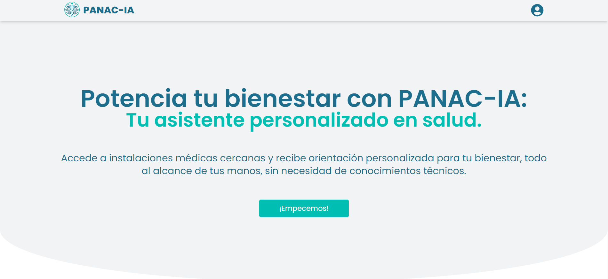
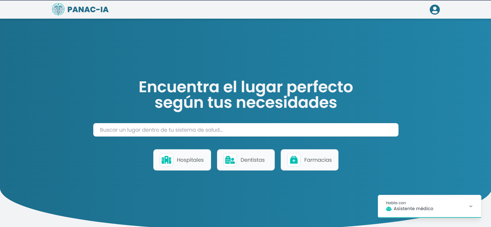
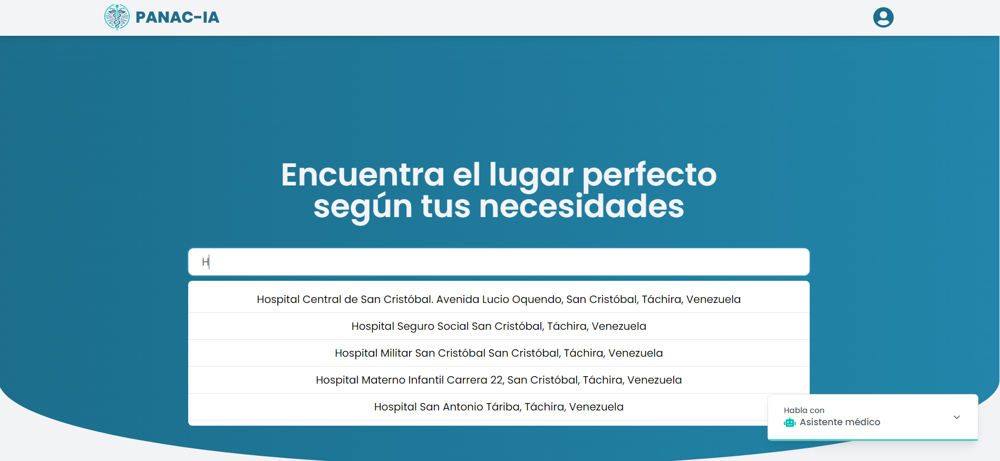
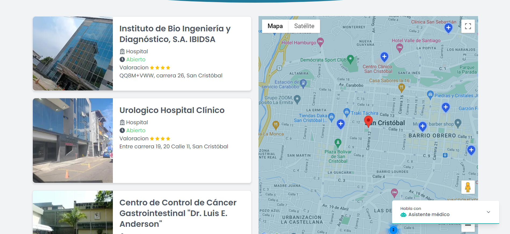
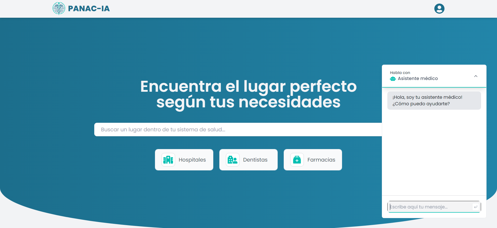

# 🚀 PANAC-IA - Una integración de Google Maps API con un asistente virtual 🔎

## Dependencias utilizadas en el desarrollo del programa

- [NextJS](https://gulpjs.com/](https://react-hot-toast.com/))
- [Next-Auth](https://next-auth.js.org/)
- [React Google Maps Api](https://visgl.github.io/react-google-maps/)
- [MongoDB](https://www.mongodb.com/)
- [Prisma](https://www.prisma.io/)

## Introducción

Inicialmente cuenta con un panel que permite al usuario conocer los hospitales cercanos en un radio de hasta 2,5 kilometros. También puede seleccionar si desea solo ver Clinicas, Dentistas o la que es por defecto, hospitales. Esto funciona en cualquier ubicación del mundo con los lugares que esten etiquetados en el Google Maps como lugares pertenecientes al área de la salud. Además, cuenta con un buscador con el que podrá buscar de forma personalizada el hospital de su preferencia en un radio de 5 kilometros.

Cada lugar cuenta con una tarjeta donde se mostrará la ubicación dada por Google Maps, su valoración representada en estrellas y una imagen de lugar, Asimismo, en el mapa se detallará el lugar.

Por otro lado, también se incluye una base de datos que permite al usuario registrarse y acceder a la función normal de programa. Creando la posibilidad de escalar más el programa a sistemas con lugares favoritos o traslados en tiempo real.

Finalmente, cuenta con un asistente virtual la cual es una integración de la api de OpenAI con CHAT-GPT que esta configurada para dar solo instrucciones referentes al área de la salud enfatizando siempre recomendaciones y orientaciones que deben ser siempre confirmadas por un especialista en el área.

## Instalación del programa

1.  `git clone https://github.com/Jalch0/panac-ia.git`
2.  En el archivo .env se deberá agregar las API de OpenAI y de Google Maps, La base de datos y las claves correspondientes al Next-Auth y el Cloudinary.
3.  `DATABASE_URL, NEXTAUTH_URL, NEXTAUTH_SECRET, GOOGLE_MAPS_API_KEY, NEXT_PUBLIC_CLOUDINARY_CLOUD_NAME, NEXT_PUBLIC_CLOUDINARY_API_KEY, CLOUDINARY_API_SECRET`
4.  En el archivo schema.prisma se ubicará el modelo de base datos que se utilizó en mongoDB.
5.  Es importante que al momento de agregar la API de Google, la misma en la cloud console, deberá estar habilitado para la opción "Places"
6.  `npm install`
7.  `npm run dev`

## Requisitos del programa

1. Extensión NO-CORS en Google Chrome.

## Link del sitio.

- [PANAC-IA](https://panac-ia.vercel.app/)
